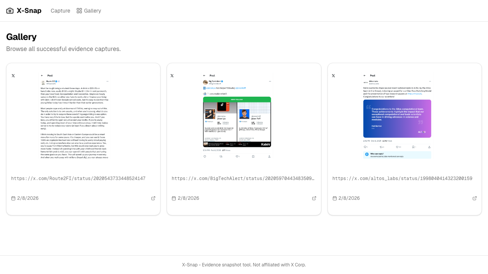

# X-Snap - Evidence Snapshot Capture

Capture and preserve evidence snapshots of X/Twitter posts with full-page screenshots, PDFs, rendered HTML pages, and cryptographic hashes.

**Live demo:** [x-snap-production.up.railway.app](https://x-snap-production.up.railway.app/)

### Capture page — paste URLs and submit


### Gallery — browse all captured evidence



### Detail — view screenshot, download artifacts, verify hashes


## Quick Start (Docker)

```bash
docker compose up
```

Open [http://localhost:3000](http://localhost:3000).

## Local Development

```bash
# Install dependencies
npm install

# Install Playwright Chromium
npx playwright install chromium

# Generate DB migration (already committed, but if schema changes)
npm run db:generate

# Start dev server (worker runs in-process automatically)
npm run dev
```

Open [http://localhost:3000](http://localhost:3000).

## How It Works

1. Paste one or more X/Twitter URLs into the textarea
2. Click "Capture" - jobs are queued in SQLite
3. Background worker (runs inside the Next.js server via `instrumentation.ts`) picks up jobs
4. For each URL, Playwright opens Chromium and captures:
   - Full-page PNG screenshot
   - Print-to-PDF
   - Rendered HTML page (`page.content()` — the full DOM after JS execution)
   - Metadata JSON (URL, timestamp, UA, viewport, versions)
   - SHA-256 hashes of all files
5. View results in the Gallery or Detail pages — toggle between **Webpage** (interactive HTML in iframe) and **Screenshot** (static PNG)

## Stored Artifacts

Each capture is stored in `{XSNAP_DATA_DIR}/{captureId}/` with these files:

| File | Format | Description |
|---|---|---|
| `screenshot.png` | PNG | Full-page screenshot (permanent visual evidence) |
| `page.pdf` | PDF | Print-to-PDF of the page |
| `page.html` | HTML | Rendered DOM snapshot — the complete page HTML after all JS has executed. Served in a sandboxed iframe on the detail page so you can view/interact with the archived page, not just a static image. External resources (images, CSS) still reference their original X/Twitter CDN URLs. |
| `metadata.json` | JSON | Capture context: URL, timestamp, user agent, viewport, Playwright version |
| `hashes.json` | JSON | SHA-256 hashes of all artifact files for integrity verification |

On failure, `error-screenshot.png` and `error-metadata.json` are saved instead.

## Environment Variables

| Variable | Default | Description |
|---|---|---|
| `XSNAP_DATA_DIR` | `./data/x-snap` | Artifact storage directory |
| `XSNAP_STORAGE_STATE_PATH` | - | Playwright storageState JSON for X auth |
| `XSNAP_CONCURRENCY` | `2` | Max parallel captures |
| `XSNAP_MAX_RETRIES` | `3` | Max retries per capture |
| `XSNAP_RETENTION_DAYS` | `0` | Auto-delete after N days (0=keep) |
| `XSNAP_HAR_ENABLED` | `false` | Enable HAR recording |
| `XSNAP_AUTO_SCROLL` | `true` | Scroll pages to load lazy content |
| `XSNAP_RATE_LIMIT` | `10` | Max submissions per minute |
| `PLAYWRIGHT_WS_ENDPOINT` | - | Remote browser endpoint |

## X Authentication

X may require login for some content. To use authenticated captures:

1. Run Playwright locally and log into X manually
2. Save the storage state: `npx playwright codegen --save-storage=storage-state.json`
3. Set `XSNAP_STORAGE_STATE_PATH=./storage-state.json`

## Cloud Deploy

**Railway:** Connect repo, add a volume mounted at `/data`, set `RAILWAY_RUN_UID=0`.

**Fly.io:**
```bash
fly launch
fly volumes create xsnap_data --region iad --size 1
fly deploy
```

## Tests

```bash
npm test
```
